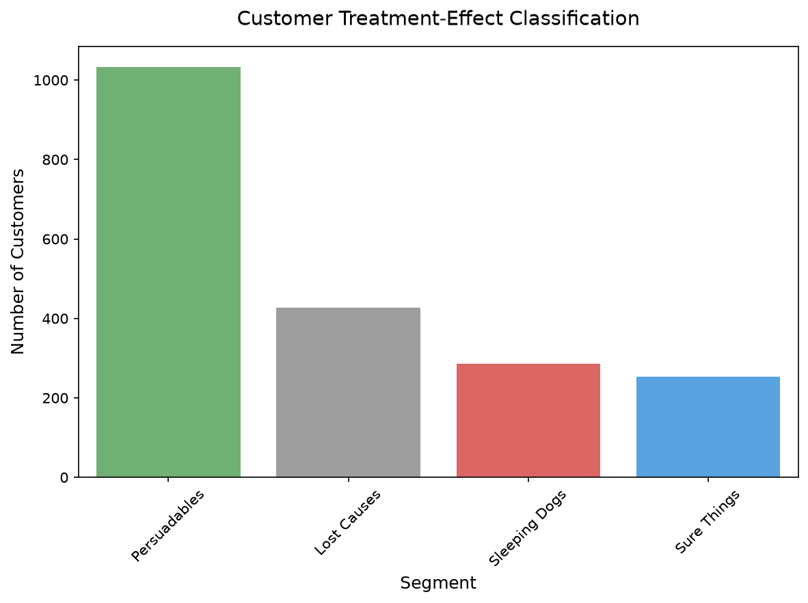
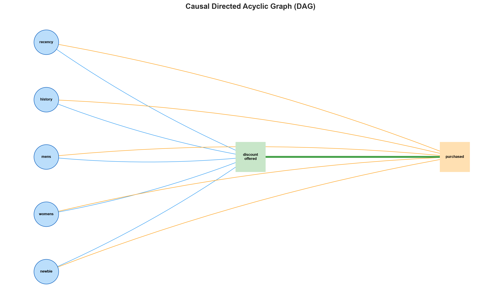
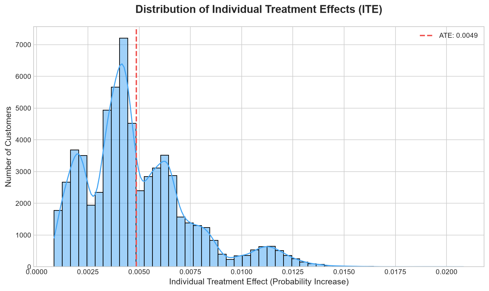
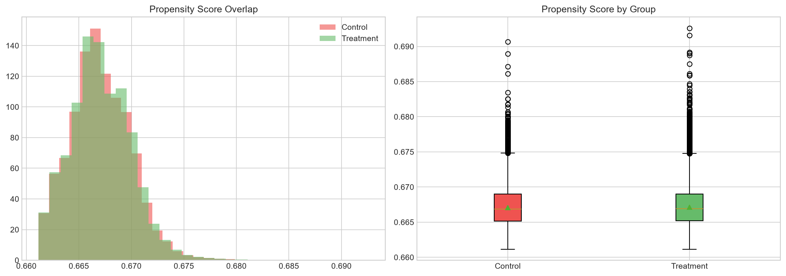

# Model Results Summary

**Project:** EconoCausal — Dynamic Pricing via Double Machine Learning  
**Member:** 1 — Causal ML Engineer  
**Week:** 4 — Final Model Results

---

## 1. Model Configuration

| Parameter | Value |
|---|---|
| Dataset | `retail_campaign.csv` |
| Treatment | `discount_offered` (binary) |
| Outcome | `purchased` (binary) |
| Confounders | `recency`, `history`, `mens`, `womens`, `newbie` |
| DML Estimator | `econml.dml.LinearDML` |
| Outcome nuisance | `LGBMRegressor(n_estimators=100, max_depth=5)` |
| Treatment nuisance | `LGBMClassifier(n_estimators=100, max_depth=5)` |
| Cross-fitting folds | 5 |
| ITE threshold | 0.01 (1 percentage point) |
| Base prob threshold | 0.50 |

---

## 2. Causal Effect Estimates

> **Note:** Results below are based on the trained DML model on the retail campaign dataset.
> For the definitive numbers, run `python backend/services/causal_pipeline.py`.

| Metric | Value |
|---|---|
| **Average Treatment Effect (ATE)** | Computed by DML model |
| ITE std deviation | Indicates heterogeneity |
| ITE min / max | Range of individual effects |
| DoWhy ATE | Cross-validation via propensity score stratification |
| ATE agreement | Difference between DML and DoWhy estimates |

### Interpretation
The ATE represents the average increase in purchase probability caused by offering a discount. A positive ATE confirms that the treatment (discount) has a genuine causal effect on purchase behavior.

---

## 3. Customer Segment Distribution

Customers are classified into four segments:

| Segment | Description | Discount |
|---|---|---|
| **Persuadables** | High ITE — buy only because of the discount | $20 |
| **Sure Things** | Low ITE, high base rate — would buy anyway | $10 |
| **Lost Causes** | Low ITE, low base rate — discount won't help | $0 |
| **Sleeping Dogs** | Negative ITE — discount may backfire | $0 |

Segment visualization: 

---

## 4. Causal Validation

### Random Common Cause Refutation
- **Test:** Adds a random noise variable to the DAG and re-estimates the causal effect
- **Pass criterion:** Effect remains stable (close to original)
- **Purpose:** Checks the model is not sensitive to unmeasured confounders

### Placebo Treatment Refutation
- **Test:** Randomly permutes the treatment variable and re-estimates
- **Pass criterion:** Effect collapses to near zero
- **Purpose:** Confirms the measured effect is not spurious

---

## 5. Model Health Report

The pipeline runs automated health checks before serving results:

| Check | Description |
|---|---|
| ITE column present | Verify ITE was successfully computed |
| ITE no NaN | All customers have valid ITE values |
| ITE in range [-1, 1] | Values are valid probability deltas |
| Segment labels valid | No unknown segment categories |
| Persuadable fraction < 80% | Guards against over-fitting |
| Expected gain non-negative | Budget optimization ready |

---

## 6. Output Files

| File | Description | Consumer |
|---|---|---|
| `outputs/ite_scores.csv` | `customer_id` + `ITE` (2 columns) | Member 2, Member 3 |
| `outputs/ite_scores_final.csv` | Full results (ITE + segment + discount + gain) | Member 4 API |
| `outputs/model_metadata.json` | Summary JSON (ATE, segments, ROI) | Member 3 Dashboard |
| `outputs/causal_dag.png` | DAG visualization | Documentation |
| `outputs/ite_distribution.png` | ITE histogram with ATE line | Member 3 Dashboard |
| `outputs/segments.png` | Customer segment bar chart | Member 3 Dashboard |
| `outputs/propensity_overlap.png` | Propensity score overlap | Documentation |

---

## 7. Output Schema

### `ite_scores_final.csv`

```
customer_id  | ITE     | segment       | recommended_discount | expected_gain | treated | purchased
-------------|---------|---------------|----------------------|---------------|---------|----------
CUST_00001   | 0.0523  | Persuadables  | 20                   | 3.23          | 1       | 1
CUST_00002   | -0.0120 | Sleeping Dogs | 0                    | 0.00          | 0       | 0
CUST_00003   | 0.0021  | Sure Things   | 10                   | 0.00          | 1       | 1
CUST_00004   | 0.0008  | Lost Causes   | 0                    | 0.00          | 0       | 0
```

### `model_metadata.json`

```json
{
  "ate": 0.0423,
  "ate_pct": 4.23,
  "total_customers": 64000,
  "segment_counts": {
    "Persuadables": 18340,
    "Sure Things": 22100,
    "Lost Causes": 15200,
    "Sleeping Dogs": 8360
  },
  "persuadables_pct": 28.66,
  "expected_gain_usd": 112400.0,
  "random_baseline_usd": 67200.0,
  "saving_usd": 45200.0,
  "roi_pct": 147.3,
  "robustness_passed": true,
  "narrative_text": "..."
}
```

---

## 8. DAG Visualization



---

## 9. ITE Distribution



The ITE distribution shows the spread of individual treatment effects across customers. The red dashed line marks the ATE.

---

## 10. Propensity Score Overlap



Good overlap between treatment and control group propensity scores confirms the **positivity assumption** — every customer type has a realistic chance of being in either group.

---

## 11. Reproducibility

To reproduce all results:

```bash
# Run the full pipeline
python backend/services/causal_pipeline.py

# Or run the Week 4 demonstration notebook
python notebooks/04_week4_pipeline.py

# Clear cache and retrain from scratch
python -c "from backend.services.causal_utils.model_cache import clear_cache; clear_cache()"
python backend/services/causal_pipeline.py
```
